# Use-EMR-to-Build-Machine-Learning-Model

## Scenario

Amazon EMR is a computing service that can be used to analyze and process large amounts of data through AWS cloud virtual machines clusters. EMR clustering leverages Hadoop's open source framework management and allowing users to focus on data processing and analysis without having to worry about configuration, management, and optimization of Hadoop clusters.

ETL (Extract-Transform-Load) is the process that data from the source through extract, transform, and load to the destination, the main purpose of which is usually to convert real-time or unstructured data through a series of data preprocessing, into a user-friendly form to query or train models.

This series of processes to improve raw data, also known as data enrichment, by merging data and calculating new features in the ETL process. This process can help companies transform limited data into more appropriate decision assets based on their operational conditions.

EMR's strengths in ETL and machine learning are that Hadoop's distributed computing technology can handle large data or complex computations with big data or algorithms. With MapReduce, users can handle huge data in parallel on thousands of machines. This greatly reduces data processing and modeling time.
 
## Use Case in this Lab


In this lab, we use Portugal bank marketing data. This data set is divided into two data, which provides basic information about users, such as age, work, marital status, education, etc. and how the bank marketed this customer, such as the last contact time, contact details, etc.

We first use EMR with hive and spark dataframe to merge the two data frames, calculate the column required and replace some missing values, so that the data is clean and stored into S3 bucket for subsequent machine learning processes.

Next, we use python's pyspark package to build machine learning models in EMR to determine whether customers will buy deposits, and finally, we compare the differences between data before and after data enrichment in the same model to highlight the importance of data enrichment. This modeling process will be done in Zeppelin notebook.

 
## Architect

<p align="center">
    </p>

## Prerequisites

* Create an S3 bucket to store ETL data and download the **BankMkt2.csv** in this lab and temporarily put it in your S3 bucket.


* Download Zeppelin Note json file in this lab.

 
## Step by step
1. **Configuring Security Groups** 

Before creating an EMR cluster, we must configure security groups.

* Create a security group in the **EC2** service and configure the **security group** as follows: 

  * Security Group Name: ```EMR Security Group``` 
  * Description: ```Security for the EMR``` 
  * VPC: ```No VPC```

* Set up security group rules, select **Inbound**, and tap **Add Rule**. Use the values in the following figure to set the following rule: 
  * Allows administrators to SSH access Master node. 
  * 8890 Port that can be accessed by anyone.

<p align="center">
    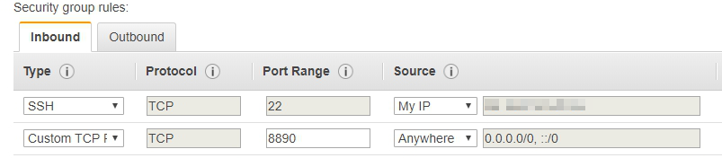</p>


2.    **Create EMR cluster**

In this section, we will create an EMR cluster on the AWS console and deploy the required software versions and security settings.

* In the AWS Console, open the service and tap **EMR** service. 

* Choose **Create Cluster** and **Go to Advanced Options**. 

* In **Step 1: Software & Steps:** Select **EMR 5.20.0** from the Release menu and check the box shown below.

<p align="center">
    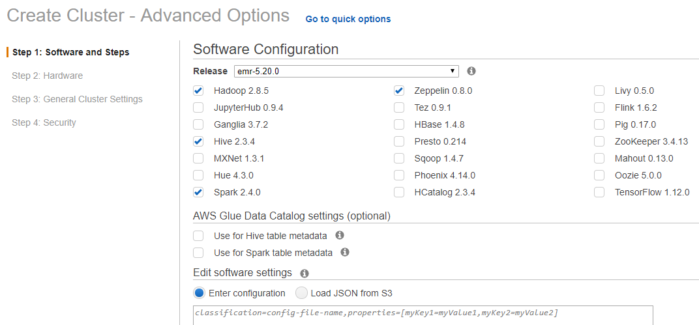</p>

* Choose a VPC and subnet that you have built.

<p align="center">
    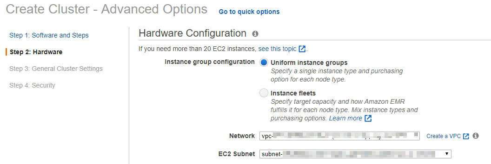</p>

* Select the **m4.large** instance and click the box **Spot**.

> Selecting Spot Instances allows you to significantly reduce EMR costs.

<p align="center">
    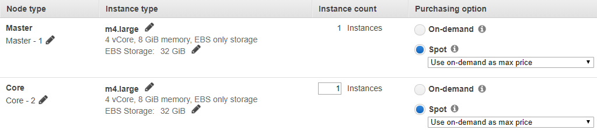</p>

* On the General Options, type the cluster name you like and select an S3 bucket where you want to store some log.

<p align="center">
    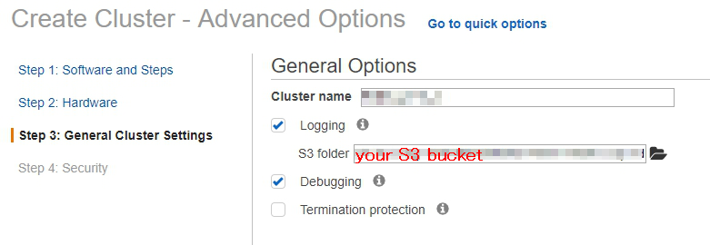</p>

* On the Security Options, select EC2 key pairs and **EC2 security groups** that you have previously created. In the **Permissions** section, select **Default**.


<p align="center">
    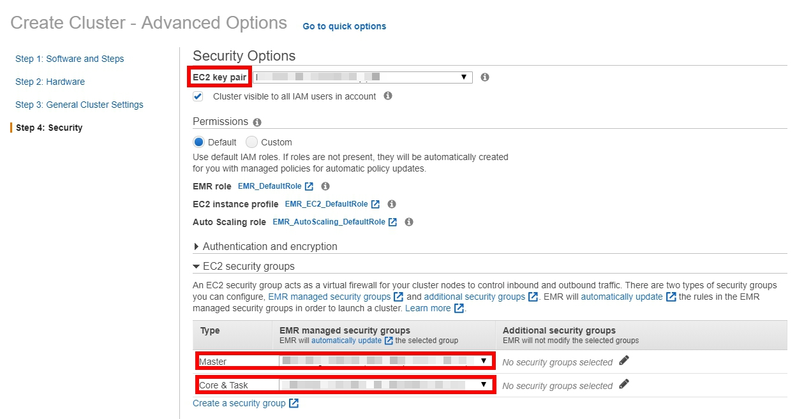</p>


3. **Starting the ETL process** 
  
   This step is mainly to merge and clean data using hive and spark. Before this step, we use SSH to connect to EMR master node and connect to zeppelin notebook via 8890 port.

    a.    After SSH connects to the EMR master node, use the following command to create a new hdfs dictionary and give read permissions:

        hadoop fs -mkdir /user/zeppe-user
        hadoop fs -chmod 777 /user/zeppe-user

    b.    Then we get the data from the specified data link:
        
        mkdir /tmp/banktmp1
        wget -O /tmp/banktmp1/BankMkt1.csv https://s3.amazonaws.com/ecv-training-jj-v/emretl/bankMKT/BankMkt1.csv


    c.      Build a new dictionary and put the downloaded data distributed into HDFS: 
    > HDF (Hierarchical Data Format) is a distributed storage technology of Hadoop that can store data on different nodes. This technology is designed to handle MapReduce computation of big data.

        hadoop fs -mkdir /user/zeppe-user/bankmkthdf/
        hadoop fs -put /tmp/banktmp1/BankMkt1.csv /user/zeppe-user/bankmkthdf


    d. Open Hive and create tables 
    The purpose of this step is to create a Hive table for the data. In the next steps, we will use this data for a simple ETL. 

    >Hive is a Hadoop based data warehouse tool that maps structured data files into a database table and provides complete SQL query functionality to convert SQL language run for MapReduce tasks, which can be used to perform extract conversion loading (ETL).


* Enter the following command in EMR:

    * Open Hive

            hive

    * Create metadata for bankmkt1 table

            CREATE EXTERNAL TABLE IF NOT EXISTS bankmktable1
            (
            id          string,
            age         int,
            job         string,
            marital     string,
            education   string,
            default     string,
            housing     string
            )
            ROW FORMAT SERDE 'org.apache.hadoop.hive.serde2.OpenCSVSerde'
            WITH SERDEPROPERTIES
            (
            "separatorChar" = '\,',
            "quoteChar"     = '\"'
            )
            STORED AS TEXTFILE;

    * Load data into the table

            LOAD DATA INPATH '/user/zeppe-user/bankmkthdf' INTO TABLE bankmktable1;

    * See the first two rows

            SELECT * FROM bankmktable1 DESC LIMIT 2;

    * Create metadata for bankmkt2 and load data from S3 bucket.

            CREATE EXTERNAL TABLE IF NOT EXISTS bankmktweb2 (
            id              string,
            loan            string,
            contact         string,
            month           string,
            dayofweek       string,
            duration        int,
            campaign        int,
            pdays           int,
            previous        int,
            poutcome        string,
            empvarrate      int,
            conspriceidx    double,
            consconfidx     double,
            euribor3m       double,
            nremployed      double,
            label           int
            )
            ROW FORMAT DELIMITED FIELDS TERMINATED BY ',' LINES TERMINATED BY '\n'
            LOCATION 's3://<your s3 data path>/'
            TBLPROPERTIES("skip.header.line.count"="1");

    * See the first two rows

            SELECT * FROM bankmktweb2 DESC LIMIT 2;

    * Exit hive

            exit;
 

*    Open Zeppelin Notebook

    In this step, we will use spark to merge and clean the data in Zeppelin notebook. 

* Copy the public DNS of Master node in the EMR Cluster you just created and add ```:8890``` at the end of the URL. 

> 8990 is Zeppelin default port.

<p align="center">
    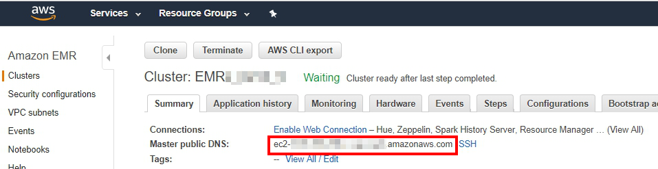</p>

* After connecting to Zeppelin, tap **Import note** to create two new notes and select **Select JSON File**. These two files can be downloaded in this GitHub.
<p align="center">
    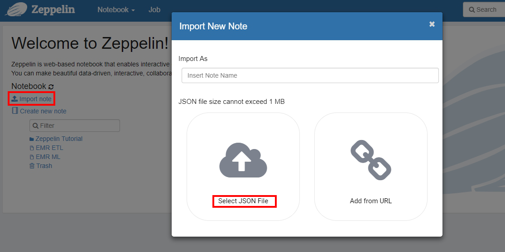</p>

* After the creation is completed, we can see two new notes for ETL and ML respectively. 

<p align="center">
    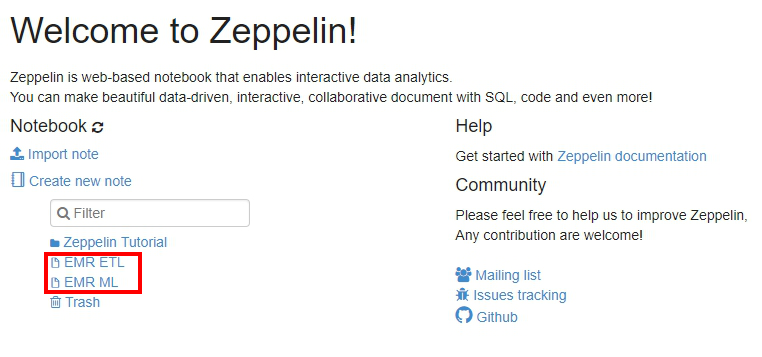</p>

* First we open the **EMR ETL** notebook, execute the first cell command, read and merge the two data table. 

<p align="center">
    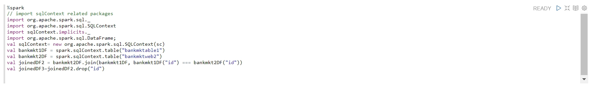</p>

* You can view the form of the data, here we found some missing and unknown values that we want to replace. 

<p align="center">
    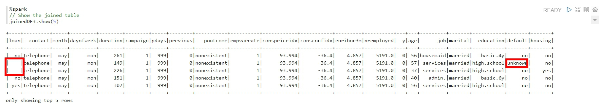</p>

* We can replace missing value and check the data change has been completed with the following command: 

<p align="center">
    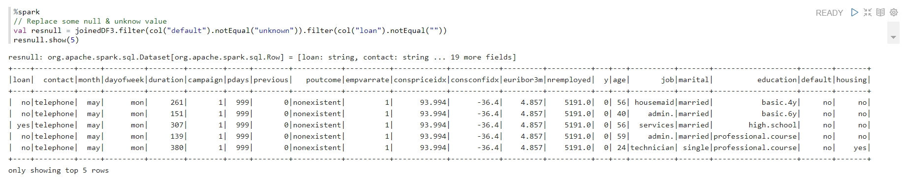</p>

* Then we save this data to an S3 bucket.
>Please keep this path in mind, we have to read it in ML part.

<p align="center">
    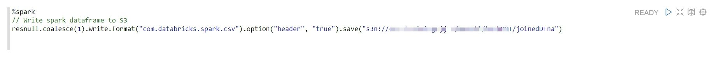</p>

* Draw plot in Zeppelin with spark sql
>Zeppelin provides visual interactive interface tools that we can use with spark sql to query data and draw some diagrams.

<p align="center">
    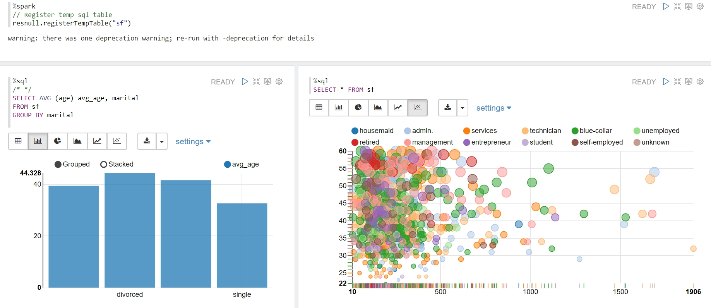</p>

4. **Creating an EMR Machine Learning Process**

    After the ETL process, we then read this clean data from the S3 bucket and set up the machine process. We use pyspark suite to combine spark with python for machine learning analysis. In this lab, a machine learning pipeline was created to encode the categorical variables into dummy variables.

    > pyspark can call HDF distributed storage data, combined with spark dataframe to train machine learning models faster.

* Read data

    Let's access data from our S3 bucket using the following code:
    >Here you have to change the path of your csv file in S3 bucket.

<p align="center">
    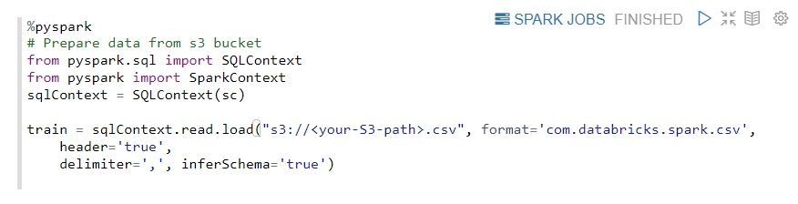</p>

* Split Training & Testing dataset
    > Here we set random seeds to ensure that the data is the same every random sampling.

<p align="center">
    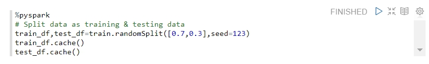</p>


* Creating Machine Learning Process Parameters

> Machine learning pipeline connect all machine learning processes, build machine learning pipeline so that we only need to manage source data, do not have to convert data and define machine learning model parameters repeatedly.


* First, we use the following parameters to help us build an ML pipeline, which represents:
    
    1. ```dt```: Decision tree model.
    2. ```indexers```: This parameter helps convert the string of data to a numeric value.
    3. ```encoders```: This parameter converts the numeric value of the previous parameter into 0,1 variables.
    4. ```assembler```: Integrates all the features into one features vector.


<p align="center">
    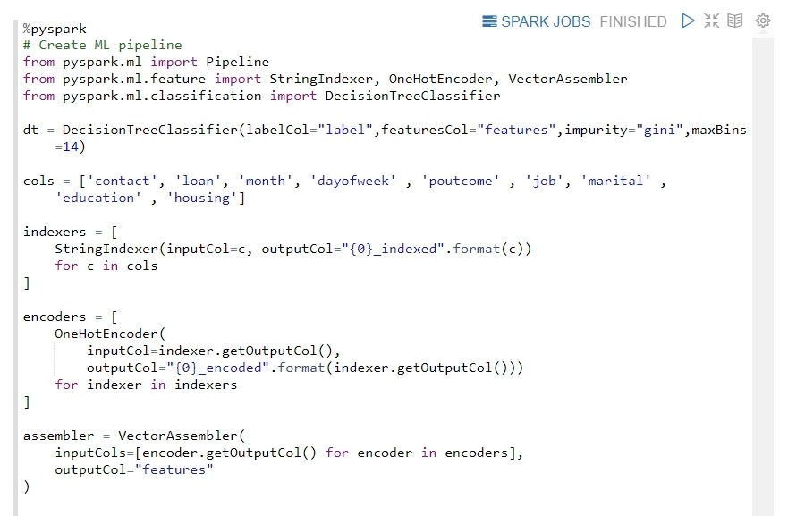</p>

* Build Machine Learning pipeline

    >Establishing ML pipeline help you to integrate these parameters into an automated process of processing data and modeling.

<p align="center">
    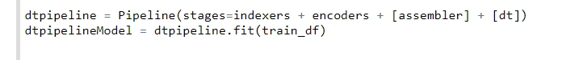</p>

* Train decision tree model
    >Now we can train the machine learning model with ML pipeline, we just need to change the testing data. And we can evaluate this model. The evaluation function we use here is AUC, which is a value between 0 and 1, the closer to 1 means that the model behaves better.

<p align="center">
    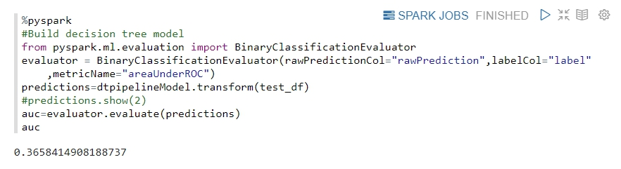</p>

* Train random forest model
    >To compare the differences between models, we build a random forest model here and apply cross-validation method to improve our model performance.

<p align="center">
    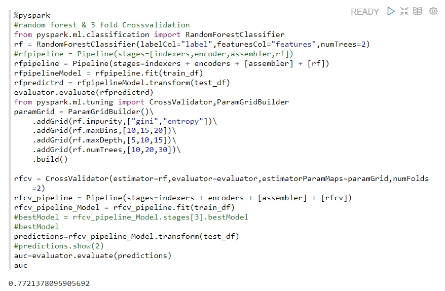</p>


* Predict new user data with existing models
    >To evaluate the model, we can enter new data to predict whether the customer will buy bank deposits.

<p align="center">
    </p>

* Comparison with unenriched data
    >We know that data enrichment is important, and we want to know how unenriched data will behave in the same model.

<p align="center">
    </p>

## Cleanup
After this lab, you must delete some resources to avoid unnecessary costs:
* EMR cluster 
* S3 bucket

## Conclusion
Now you have learned how to use EMR to do simple ETL processes and build machine learning pipelines. The data used in this experiment is not very large, so you can not experience the advantages of EMR. After the experiment, you can train machine learning model with your own data set and compare with a single Host.
 

